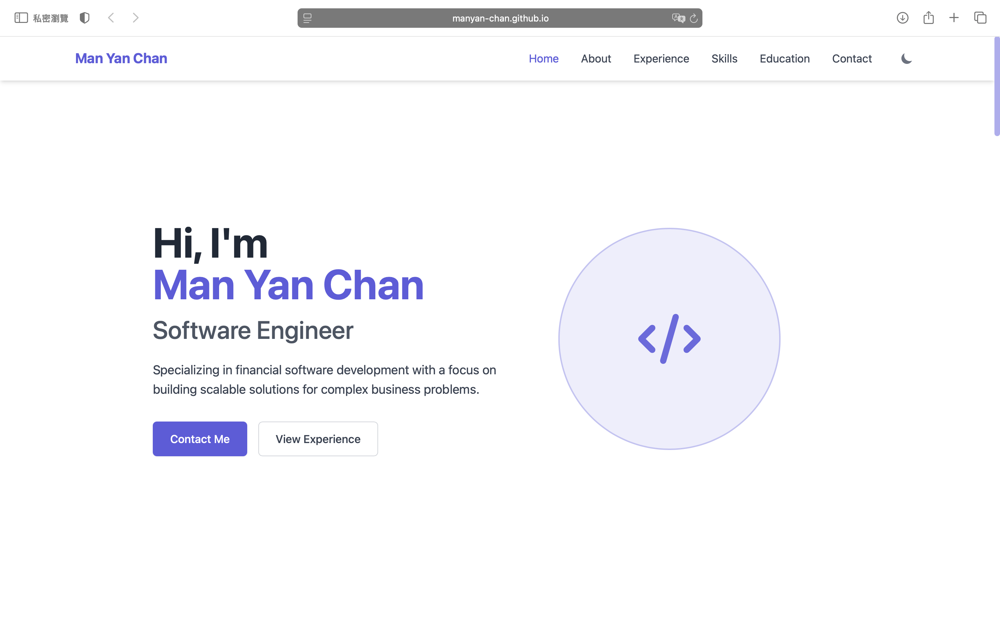

# Man Yan Chan - Personal Portfolio Website

 <!-- Optional: Replace screenshot.png with an actual screenshot file -->

This repository contains the source code for my personal portfolio website, showcasing my skills, experience, and background as a Software Engineer specializing in the financial sector.

**[View Live Demo](https://manyan-chan.github.io/)** <!-- Make sure this link is correct -->

---

## ✨ Features

*   **Responsive Design:** Adapts seamlessly to various screen sizes (desktop, tablet, mobile) thanks to Tailwind CSS.
*   **Sections:** Includes dedicated sections for Home (intro), About Me, Professional Experience (timeline format), Technical Skills (with progress bars), Education & Certifications, and Contact.
*   **Dark/Light Mode:** Supports both themes with automatic detection based on user's system preference and a manual toggle button. Smooth transitions included.
*   **Interactive Experience Timeline:** Visually represents career progression.
*   **Smooth Scrolling:** Navigation links smoothly scroll to the corresponding sections.
*   **Active Navigation Highlighting:** The current section's link is highlighted in the navigation bar as you scroll.
*   **AJAX Contact Form:** Functional contact form that submits data asynchronously (using Formspree) without page reloads, providing user feedback.
*   **Scroll-to-Top Button:** Appears on scroll for easy navigation back to the top.
*   **Font Awesome Icons:** Utilized for clear visual cues and branding.
*   **Tailwind CSS:** Built using the utility-first CSS framework (via CDN for simplicity in this version).

---

## 🚀 Technologies Used

*   **HTML5:** Semantic structure for the content.
*   **CSS3:** Custom styles and animations.
*   **Tailwind CSS v3 (via CDN):** Utility-first CSS framework for rapid UI development.
*   **JavaScript (ES6+):** For interactivity, including:
    *   DOM Manipulation
    *   Dark Mode Toggle
    *   Smooth Scrolling
    *   Active Link Highlighting
    *   Mobile Menu Toggle
    *   AJAX Form Submission (`fetch` API)
    *   Scroll-to-Top Button Logic
*   **Font Awesome (via CDN):** Icon library.
*   **Formspree:** Backend service for handling the contact form submissions.

---

## 🛠️ Setup and Running Locally

As this project currently uses CDN links for Tailwind CSS and Font Awesome, no build step is required to view it.

1.  **Clone the repository:**
    ```bash
    git clone https://github.com/your-username/your-repo-name.git # Replace with your repo URL
    ```
2.  **Navigate to the directory:**
    ```bash
    cd your-repo-name
    ```
3.  **Open the `index.html` file:**
    Simply open the `index.html` file directly in your web browser (e.g., Chrome, Firefox, Safari, Edge).

---

## 📝 Potential Future Improvements

*   **Tailwind CSS Build Step:** Implement a build process (e.g., using Node.js and Tailwind CLI/PostCSS) to compile CSS into a static file for improved production performance.
*   **Accessibility Audit:** Perform a more thorough accessibility review (WCAG compliance).
*   **Image Optimization:** Optimize any images used for faster loading.
*   **Add Projects Section:** Create a dedicated section to showcase personal or professional projects with links and descriptions.

---

## ✉️ Contact

*   **GitHub:** [manyan-chan](https://github.com/manyan-chan)
*   **LinkedIn:** [Richard Chan (Man Yan)](https://www.linkedin.com/in/richard-chanmy/)
*   **Portfolio:** [manyan-chan.github.io](https://manyan-chan.github.io/)
*   **Email:** manyanchanmanyan@gmail.com

---

Copyright (c) 2025 Man Yan Chan